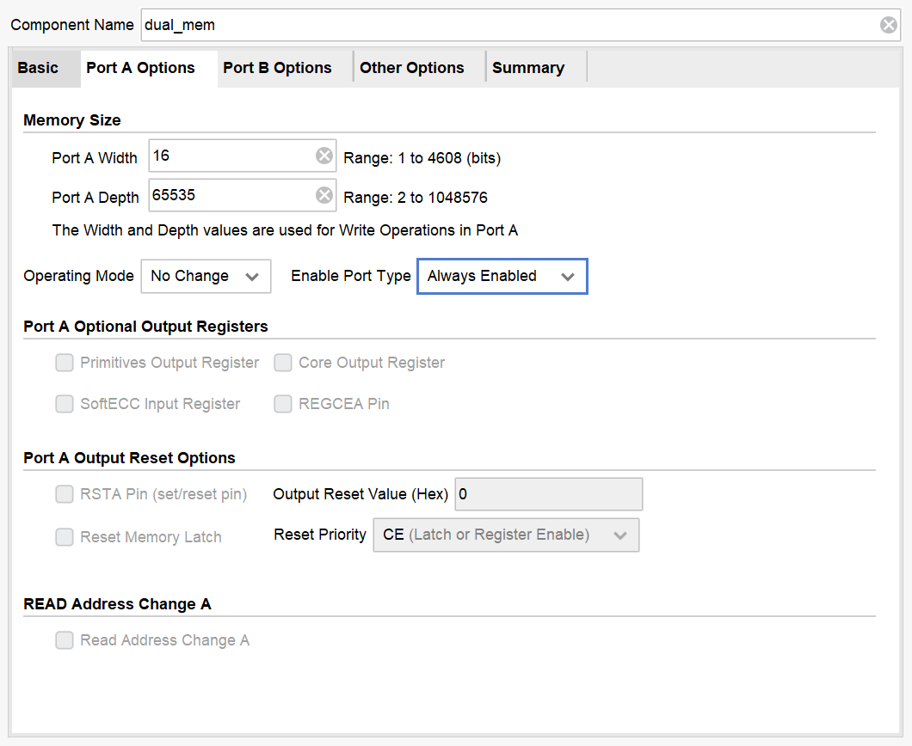

# LC3-Userguide

## 一、项目介绍

Chisel_LC3项目设计用于计算机体系结构课程的进阶教学使用，项目使用Chisel作为开发语言，实现了基于LC3指令集架构的简单处理器。

LC-3全称是[Little Computer 3](https://en.wikipedia.org/wiki/Little_Computer_3)，是一种用于教学的指令集，其特点就是结构简单，相比于x86这类复杂的指令集来说，更容易实现，又具有指令集基本的功能，能够编写较复杂的一些汇编程序。使用LC-3能够更好的将精力集中于处理器处理执行指令的流程中，而不是指令集本身。

[Chisel](https://www.Chisel-lang.org/)是一种硬件设计语言，是在[Scala](https://www.scala-lang.org/)语言中添加了硬件构造基元(Hardware Construction Primitives)，能够通过编译生成可综合的的Verilog代码，其相对于直接使用Verilog，Chisel生成的电路能够更好的参数化，对象化，使其在编写的过程中能够更多的使用面向对象编程的思想。

本项目中LC-3的实现是参考[计算机系统概论](https://book.douban.com/subject/2185076/)中的LC-3实现的，目前已能够在计算机上仿真运行，终端和异常控制部分暂时没有实现。

## 二、环境配置

**Ubuntu**

系统使用的是Windows10 WSL，Ubuntu 20.04.1 LTS

**mill**

[mill](http://www.lihaoyi.com/mill/)是用于Java、Scala的项目构建工具，项目使用的mill版本是0.7.4

在终端运行如下命令能够安装mill，如果下载失败可能是网络问题，请多试几次

```shell
sudo curl -L https://github.com/lihaoyi/mill/releases/download/0.9.4/0.9.4 > /usr/local/bin/mill && sudo chmod +x /usr/local/bin/mill
```

在安装成功后运行

```shell
mill version
```

下载完成后看到mill版本号即表示安装成功

**Verilator**

[Verilator](https://www.veripool.org/wiki/verilator)是一个开源模拟器，能够将Verilog代码转换为C++代码，在系统上进行仿真，模拟硬件运行时的情况。verilator的安装很简单，只需要使用apt工具下载安装即可。本项目使用的verilator版本为4.028

```shell
sudo apt install verilator
```

安装完成后运行

```
verilator --verison
```

看到verilator版本号即表示安装成功

**LC3AS**

这是一个简单的汇编语言翻译器，用来将LC3的汇编程序翻译成机器指令，你可以显式地调用

```
lc3as [asm file]
```

来生成汇编程序对应的二进制指令文件，但实际上在仿真时通过IMAGE参数指定名字，在编译时会自动调用lc3as翻译指定程序

## 三、编译流程

仿真运行的编译流程如下图所示，首先使用mill将Chisel代码编译成Verilog代码，再用verilator将Verilog代码转换为C++代码，编译生成一个可执行文件，运行这个可执行文件即可模拟硬件运行的结果

```
+------------+    +-------------+    +---------+
|            |    |             |    |         |
|   Chisel   +--->+   Verilog   +--->+   C++   |
|            |    |             |    |         |
+------------+    +-------------+    +---------+
```


虽然从编写代码到真正仿真运行需要经过上面的流程，实际上在Makfile文件中已经将所有的命令写好了，想要运行项目只需要在项目根目录下执行

```
make emu
```

即可。但是要想完全了解编译流程，推荐去阅读Makefile文件和相关命令的手册，了解相关参数的作用，下表给出了Makefile文件中一些关键变量的含义

| 变量      | 作用                                                         |
| --------- | ------------------------------------------------------------ |
| TOP       | 编译生成的verilog文件名                                      |
| BUILD_DIR | 项目构建生成文件所存放的目录，例如生成的verilog文件就存放在这个目录下 |
| TRACE     | 是否生成调试用波形                                           |
| IMAGE     | 指定仿真要运行的程序名                                       |
| IMAGE_DIR | 程序文件存放的目录                                           |
| LC3_AS    | lc3翻译器所在的路径                                          |
| EMU       | 生成的仿真可执行文件的文件名                                 |


## 四、LC3工作原理
**程序加载**
程序本质上是一组计算机能识别和执行的指令，程序的加载即把程序加载到内存。在程序启动时会首先将程序加载进内存。在我们写好的LC3程序中包含了*初始PC*（即第一条指令所在的内存地址），*指令*和*数据*。加载的过程中，以初始PC为起点，按LC3程序的长度覆盖内存。

**程序如何运行**
一个简单的规定: 当执行完一条指令之后, 就继续执行下一条指令. 但LC3怎么知道现在执行到哪一条指令呢? LC3根据PC从内存取出指令，取出后PC+1，下一次取值自然就会取到下一条指令，便达到了规定的执行完一条自动执行下一条。

*跳转指令*
这是PC变化的另一个规定，遇到跳转指令，PC不是单纯加1，而是把PC设置成跳转指令的跳转目标，即运行跳转指令的下一条指令是它目标地址所指的指令。

如此指令流按照这两个规定执行到整个程序结束。

**一条指令内的执行过程**
LC3是一个多周期非流水的机器，一条指令分割成多个周期执行，且每条指令周期数可能不一样。具体每条指令的指令数可见《计算机系统概论》（第 2 版）图C-2 LC3状态机。
图中可见每条指令有某些相同步骤是相同的（18->33->35->32）,根据状态，所有指令总体上可以划分成取指、译码、执行。

- 取指在状态机中的编号为（18->33->35）,即三个步骤:
1. PC搬移到MAR, PC+1
2. 根据MAR地址从内存取指令到MDR
3. 将MDR中的指令内容搬移到IR

- 译码在状态机中编号为（32），指令第15为到12位为指令码，即判断这是一条什么指令且根据这四位决定该指令状态机的转换。若该指令为跳转指令，则11位到9位为跳转的判断条件。同理src1和src2则需要根据各个指令来判别。

- 执行在状态机中根据不同指令码分为不同的步骤，细节见图C-2。

## 五、各模块功能

**DataPath**

数据通路(DataPath)包含了与指令处理相关的所有部件，包括寄存器堆(Regfile)，译码逻辑(Decode)，算术逻辑单元(ALU)，总线(Bus)，以及一些选通逻辑。数据通路的设计参照了计算机系统概论中的图C-3。

*Regfile*

寄存器堆中有8个能够存储2Byte数据的寄存器，大部分程序都是通过对寄存器堆中的寄存器做操作来完成的，由于一条指令最多有两个源寄存器，一个目的寄存器（比如ADD A2, A0, A1，从A0，A1寄存器中读出数据做加法，将结果存入A2寄存器），因此寄存器堆设置了2个读端口，1个写端口，每周期最多能够从中读出2个数据，存入1个数据

*Decode*

这部分用于将一条2Byte的指令中各个字段的含义拆分出来，分解成操作码，寄存器号，立即数等信息，用于之后指令的执行，具体不同指令的字段含义，项目参考了计算机系统概论附录A的LC-3指令集结构

*ALU*

ALU是最基本的模块，用于做数学计算以及算术计算，纯组合逻辑组成，有3个输入口，2个输出口，ALU接收2个操作数a，b，有四种操作，分别是

| 操作                                     | 操作码 |
| ---------------------------------------- | ------ |
| a加上b，如果最高位有进位，c为1，否则c为0 | 0      |
| a逻辑与b                                 | 1      |
| a取反                                    | 2      |
| a直连输出端，不做任何操作                | 3      |

*Bus*

在不同的时刻会有不同的组件发送数据，也会有不同的组件接收数据，如果所有的数据传输都需要一一连线，代码逻辑会变得混乱且冗余，因此在项目中实现了一个最简单的总线。总线宽度为2Byte，所有需要发送数据的组件都将其输出端连到总线上，同时相对应的每一个组件有一个控制信号共同形成一串独热码(One Hot)，总线通过检测控制信号中的哪一位为1，来决定使用哪一个组件的信号作为输出。而需要接收信号的组件只要连上总线的输出端，就能够在正确的时候获得想要的信号。

**Controller**

控制器(Controller)内部实现是一个状态机，通过生成不同的控制信号，配合DataPath中的选通逻辑，能够控制各个处理单元在“特定时刻”做“特定事情”，直至指令结束，在主流处理器中，是通过将不同的任务进行拆分，每个流水级做特定的任务，使用流水线的方式工作的，在LC-3中简化了这个逻辑，通过控制器给出不同的信号来决定DataPath这周期需要做的事情。相对的，不使用流水线的代价就是LC-3只有当一条指令执行完了之后，才能够执行下一条指令，执行效率低下。控制器的设计参照了计算机系统概论中的图C-2。在控制器中有一张信号表，通过状态机当前的状态来索引这张表，得到的就是数据通路中所有选通逻辑的值，通过状态机和这张表就能够控制数据通路在不同的状态下做不同的操作。这张表是在[开源项目](https://github.com/mdrush/LC3/blob/3026928d98d2535ae62f7fbe21aac3610cbca7c4/cs/controlstore)的基础上修改的。所有的选通逻辑信号参考了计算机系统概论附录C的表C-1 数据通路控制信号

**Memory**

内存(Memory)是处理器用来存储指令和数据的存储单元，在真实的电路实现中使用一个真正的RAM模块，连接上对应的信号即可，但是在仿真中我们需要使用DPI-C(Direct Programming Interface-C)，这个接口能够令Verilog仿真中调用C语言中的函数，来实现一些特定的功能，在本项目中我们用来对Memory初始化，将需要运行的程序和一些TRAP程序初始化到Memory中指定的地址上。在有了相应的Verilog模块后，在Chisel代码中继承BlackBox基类，令这个Verilog实现的模块可以在Chisel中例化并调用

**Uart**

一个处理器和外界交互最重要的就是输入和输出，而Uart是最常用的一种通信协议，项目使用的Uart模块是在开源项目[[1]](https://github.com/huangruidtu/Chisel-uart)、[[2]](https://github.com/nyuichi/Chisel-uart)的基础上修改的，这部分功能在仿真的时候也是使用DPI-C来模拟现实硬件中Uart的输入输出，在仿真运行时模拟Uart输入的C函数会定时检查在终端是否有键盘输入，如果有的话会将输入暂存到一个缓冲中，每次Uart只能将一个Byte的数据传给LC-3，并且只有当LC-3接收了这个数据后，才能够传送下一个数据；模拟Uart输出的C函数会定时的检查LC-3有没有需要输出的数据，如果有将其打印到终端，并告诉LC-3数据已经被接收，可以发送下一个数据。

**Boot**

这个模块用于在LC3系统正式运行前，通过Uart接收需要运行的程序文件，将其放入内存后，设置LC3的初始PC，并让系统正式开始运行。

## 六、调试

在Makefile文件中有一个变量TRACE，默认是空值，如果想要生成仿真的波形文件，需要将TRACE的值设置为 -t，则在运行之后会在build目录下生成emu.vcd波形文件，使用[GTKWave](http://gtkwave.sourceforge.net/)打开即可看到波形用于调试。


## 七、FPGA运行

将整个LC3系统烧录到FPGA上运行，需要使用Vivado将之前编译生成的verilog文件TopMain.v综合并生成bit文件，然后使用bit文件生成mcf文件，将其烧录到FPGA上的Flash中。为了能够和FPGA上的系统进行交互，我们还需要在自己的电脑上安装[串口调试助手](https://www.microsoft.com/zh-sg/p/%e4%b8%b2%e5%8f%a3%e8%b0%83%e8%af%95%e5%8a%a9%e6%89%8b/9nblggh43hdm?rtc=1#activetab=pivot:overviewtab)，然后将FPGA的串口和电脑连接。接下来将详细介绍整个流程。

### 7.1 环境介绍

在此文档中使用的环境是Windows系统，微软串口调试助手，以及达芬奇Artix7开发板，在流程介绍中只对关键的一些设置进行说明，如果想了解关于开发板更详细的内容，请参考开发指南，如需要开发指南可以联系学长，或者灵活使用搜索引擎。

### 7.2 生成verilog文件

注意chisel_lc3项目默认是用仿真模式运行的，而想要生成能够烧入FPGA的verilog文件，需要将chisel_lc3/src/main/scala/LC3/Top.scala中的FPGAPlatform选项设置为true（默认是false）。设置为true后项目会将使用DPI-C进行仿真的Memory模块用真正的双端口RAM替换。并修改一些连线等细节。

```scala
object CoreConfig {
  val FPGAPlatform = true
  println("FPGAPlatform = " + FPGAPlatform)
}
```

运行

```shell
make verilog -j
```

TopMain.v文件会生成在chisel_lc3/build目录下


### 7.3 创建Vivado工程


切记选择正确的板卡型号


### 7.4 添加verilog文件与约束

将TomMain.v文件添加到项目中


创建新的约束文件，写入以下内容。约束文件声明了全局时钟，复位信号，以及绑定Uart的接口。

```verilog
create_clock -period 20.000 -name clk [get_ports clock]
set_property -dict {PACKAGE_PIN R4 IOSTANDARD LVCMOS33} [get_ports clock]
set_property -dict {PACKAGE_PIN U2 IOSTANDARD LVCMOS33} [get_ports reset]
set_property -dict {PACKAGE_PIN U5 IOSTANDARD LVCMOS33} [get_ports io_uart_rxd]
set_property -dict {PACKAGE_PIN T6 IOSTANDARD LVCMOS33} [get_ports io_uart_txd]

set_property CFGBVS VCCO [current_design]
set_property CONFIG_VOLTAGE 3.3 [current_design]
set_property BITSTREAM.GENERAL.COMPRESS true [current_design]
set_property BITSTREAM.CONFIG.CONFIGRATE 50 [current_design]
set_property BITSTREAM.CONFIG.SPI_BUSWIDTH 4 [current_design]
set_property BITSTREAM.CONFIG.SPI_FALL_EDGE Yes [current_design]
```

### 7.5 添加RAM IP核

TopMain.v文件添加完后，应该能够看到Memory模块下的双端口RAM是找不到定义的，这个RAM需要使用Vivado自带的Block Memory Generator来生成。

在Vivado 软件的左侧“Flow Navigator”栏中单击“IP Catalog”，如下图所示。


然后在弹出的窗口中搜索Block Memory Generator，图中两个结果是同一个IP核，双击选第一个即可


在弹出的配置窗口中按照下图配置





其中的init.coe文件是RAM的初始化文件。文件中包含了LC3中的TRAP程序，该文件在chisel_lc3目录下能够找到


点击Generate后，在Source面板的IP Sources标签页下会出现刚才生成的IP核


刚开始下面的文件图标可能不一样，那是因为IP核还在综合生成，当图标变为上图时表示综合完成，然后我们可以看到之前Memory模块下的dual_mem图标变了


### 7.6 生成bit/mcf文件

接下来就可以点击左侧的Generate Bitstream来综合生成bit文件了，综合实现的时间可能比较久，请耐心等待。


在生成成功后会弹出对话框，选择Generate Memory Configuration File，然后点OK，如果一不小心关闭了这个对话框，也可以在菜单栏的Tools菜单中找到


配置如下图


### 7.7 mcf文件烧录

生成成功后，在侧边栏打开Harware Manager，连接好开发板，并打开开发板开关，点击自动连接按钮


连接上开发板后，我们要在项目中为开发板添加一个固化Flash部件，选中芯片右键选择Add Configuration Memory Device


然后会询问你是否要烧写新添加的Flash，选择OK，如果不小心关闭了对话框，在新添加的Flash上右键，选择Program Configuration Memory Device


### 7.8 上板运行

烧录完成后，系统就已经烧入到开发板中了，现在重启开发板，使用串口调试助手连接上开发板的Uart串口，选择发送文件，然后选择想要运行的obj文件发送，就可以看到程序运行的输出。

> 注意，如果你运行的程序没有调用PUTS或者OUT这类输出的TRAP程序，那么可能串口没有任何输出，但其实程序已经在运行了
>
> 其次在达芬奇Artix7开发板上，RESET复位信号是低位有效的，如果想让系统正常运行，在传输程序文件以及运行时，都要保证复位按钮处于按下的状态
> 或者可以修改复位信号为其他按钮的信号，比如将约束文件中的U2改为T5，就能够将复位信号绑定到开发板的触摸按键上


下图是在开发板上使用LC3系统运行计算机系统课程实验中的NIM游戏程序

